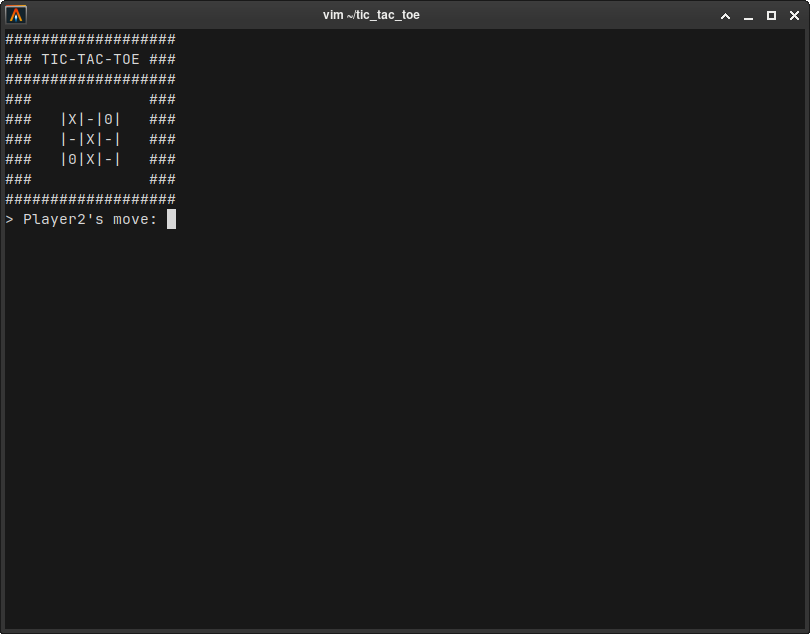

# Tic-Tac-Toe

Terminal Tic-Tac-Toe game in C++ for two players.

Features:  
- Menu with Play, Edit names, Stats, Exit  
- Players make moves by entering numbers 1–9  
- Modular code using basic OOP

### Screenshot

---

# Крестики-нолики

Игра Крестики-нолики для двух игроков в терминале на C++.

Функции:  
- Меню: Игра, Смена имён, Статистика, Выход  
- Игроки ходят, вводя цифры от 1 до 9  
- Модульный код с базовым ООП
